# Point Cloud Viewer

This tool allows viewing huge point clouds.

## Build on Ubuntu

Install dependencies

    sudo apt install build-essential cmake
    sudo apt install qt5-default libqt5opengl5-dev libboost-all-dev

Clone with

    git clone git@github.com:cgtuebingen/pointcloud-viewer.git
    cd pointcloud-viewer/
    git submodule update --init

Compile with

    mkdir build
    cd build
    cmake -DCMAKE_BUILD_TYPE=Release ../src
    make -j8

Run with

    pointcloud_viewer/pointcloud_viewer

## Usage: Basics

Load a Point Cloud with the menu bar:

> **Project > Import Pointcloud**

There are two available navigation schemes for navigating the 3d view:

- Blender  
    **View > Navigation > Blender**
- MeshLab  
    **View > Navigation > MeshLab**

### Blender Inspired Navigation Scheme

In the Blender Navigation scheme, you will see a grid:

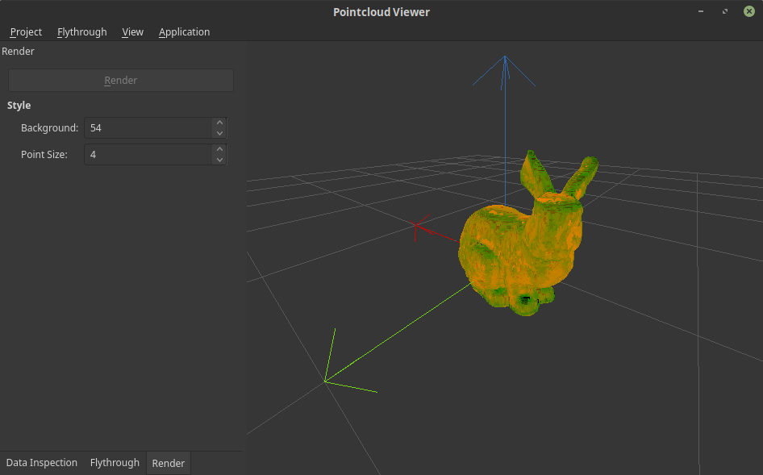

You have three different ways to navigate:

- **First Person Navigation**  
    This Navigation resembles the movement of a first person shooter game.

    1. Enter the first person navigation by pressing 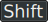+
    2. Move around
        - Look around by moving your mouse
        - Move forward/backward by holding /
        - Move left/right by holding /
        - Move up/down by holding /
        - You can roll the camera by scrolling with 
            - To reset the rolling, just press  while holding 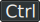.
    3. Leave the first person navigation
        - Keeping the new position by pressing 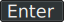 or 
        - Undo the position and reset to the old one by pressing 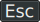 or 
- **Turntable Navigation**  
    This Navigation allows a quickly switching the perspective on the point cloud.

    - For turning the view around the object, hold  and move your mouse.
    - For shifting the view orthogonal to the view direction, hold  and  and move your mouse.
    - For changing the distance to the object, scroll with  or hold  and  and move your mouse.
- **Selecting Points**  
    You can quickly select a point and move towards it.

    - To select a single point, right click it .
    - To center the view around the selected point, press 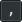 (the comma key).

### MeshLab Inspired Navigation Scheme

In the Blender Navigation scheme, you will see a trackball:

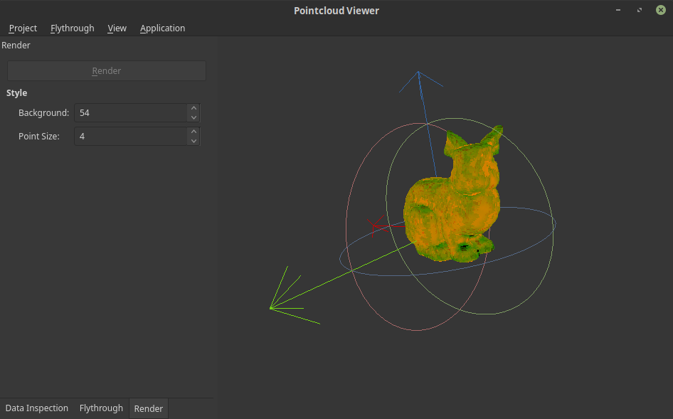

You have three different ways to navigate:

- **First Person Navigation**  
    - Usage is the same as in the Blender Navigation Scheme
- **Trackball Navigation**  
    This Navigation allows a quickly switching the perspective on the point cloud.

    - For turning the view around the object, rotate the trackball by moving it with the mouse while holding .
    - For shifting the view orthogonal to the view direction, move the trackball with the mouse while holding  and .
    - For changing the distance to the object, scroll with  or move the trackball with the mouse while holding  and .
- **Selecting Points**  
    You can quickly select a point and move towards it.

    - To select a single point, right click it .
    - To center the view around a point, double click it with  or 

Additionally, you can change the render properties:

- To change the point rendering size, hold 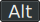 and scroll with 

## Usage: Animation

You can animate the camera by defining a camera path.
The path consists out of multiple key-points.

If you have already a ready to use camera path, you can import it with the menu bar:  

> **Flythrough > Import Path**

Alternatively, you can create your own path by navigating the camera and add a new key-point by pressing .

More options for changing the flythrough camera animation can be found in the **Flythrough-Tab** (red):

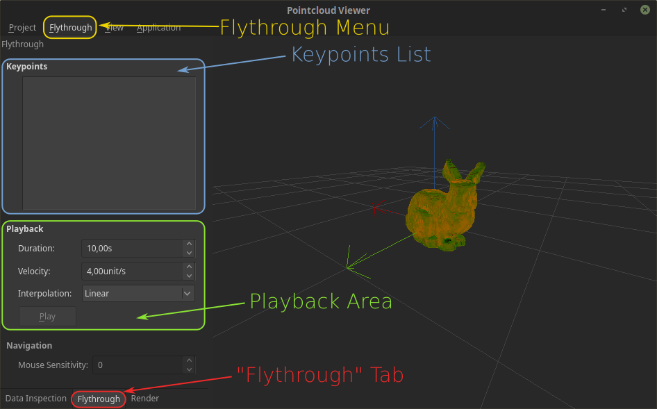

- With the **Flythrough Menu** (yellow), you can
    - export the current flythrough path
    - import an already created flythrough path
- In the **Keypoints List** (blue), you can reorder keypoints and remove unwanted keypoints.
- In the **Playback Area** (green), you can modify the
    - duration of the whole flythrough
    - velocity of the camera
    - interpolation between points

## Usage: Render

You can render the frames of the animation to single png files. To do this, go the the **Render-Tab** (red):

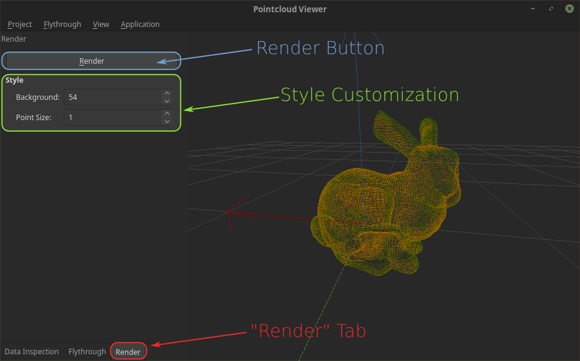

- With the **Render Button** (blue), you start the Rendering Process and start the rendering process. If this button is grayed out, you need to create a key-point for the animation (you can press  for creating a single key-point at the current camera location).
- You can customize the style
  - Change the brightness of the background (0 is black, 255 is white and 54 the default brightness)
  - Change the point size

## Typical usage: Data Inspection

You can render the frames of the animation to single png files. To do this, go the the **Data-Inspection-Tab** (red):

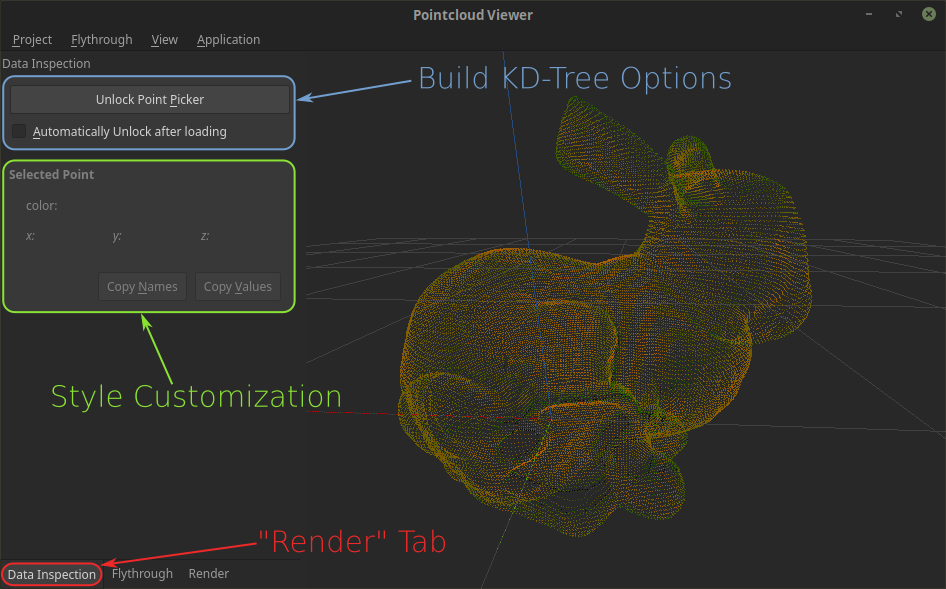

Here, you can

- Build the KD-Tree (blue)
- See information of the selected point (green)

In order to be able to pick single points, you need to build the KD-Tree first. You can to this with the bug **Unlock Point Picker** button. In order to automatically build the KD-Tree every time you load a point-cloud, check the **Automatically Unlock after loading** checkbox.

If you try to pick a point (by clicking ) without building the KD-Tree first, a remonder dialog will open and allow you to immediately build the KD-Tree:  
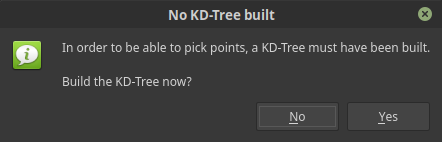

## Known Issues

Currently, no optimization technique is applied. When the pointcloud size exceeds the available video memory, the application will probably crash.
